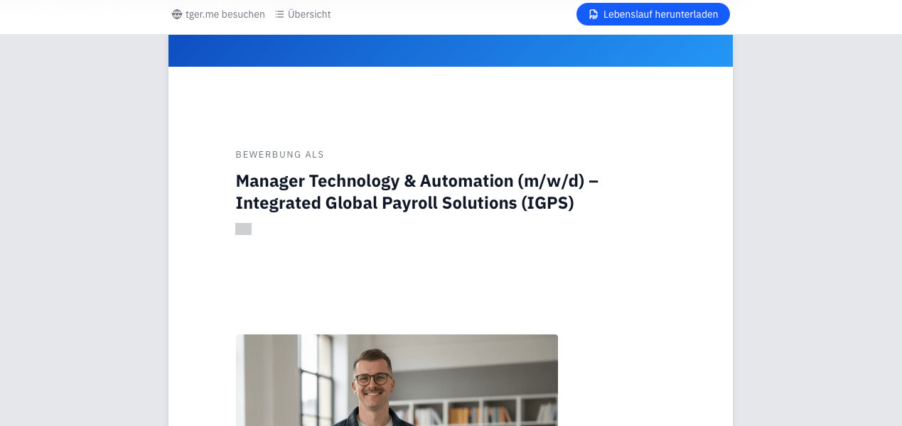
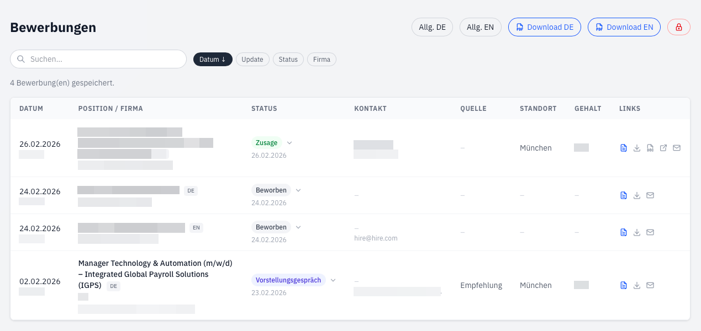

## Warum ich meinen Bewerbungsprozess in ein automatisiertes „Job-OS“ verwandelt habe

Hand aufs Herz: Bewerbungen schreiben nervt. Man jongliert mit Word-Dokumenten, korrigiert zum zehnten Mal das Datum im PDF und sucht verzweifelt den Namen des Ansprechpartners aus einer alten E-Mail.

Nachdem ich meine Website auf **Astro** umgestellt hatte, kam mir ein Gedanke: Wenn ich meine Inhalte ohnehin als Code verwalte, warum dann nicht auch meine Karriere-Unterlagen? Was als kleine Idee startete, endete in einem automatisierten System, das mir heute fast die gesamte Arbeit abnimmt. Und das Beste daran: Dank **Vibe Coding** stand das Grundgerüst innerhalb weniger Stunden.

## Die Evolution: Fokus auf die Stelle, nicht nur die Firma

Oft bewirbt man sich bei einer Firma auf verschiedene Rollen. Mein System musste also flexibel sein. Statt einer simplen Datei pro Firma basiert alles auf spezifischen **Stellenanzeigen** – und das vollständig **zweisprachig** (Deutsch und Englisch).

Dank Vibe Coding – also dem intensiven Prompting und der Zusammenarbeit mit KI – konnte ich in kürzester Zeit komplexe TypeScript-Interfaces erstellen, die weit über „Name und Datum” hinausgehen. Mein Frontmatter in den Markdown-Files sieht heute eher nach einer Datenbank-Struktur aus:

- **Stellenspezifische Metadaten:** Ansprechpartner, Anrede, Firmenadresse, Gehaltsvorstellung, Arbeitsort, Quelle – alles an einem Ort.
- **Status-Tracking:** Neun definierte Status – von „Beworben” über „Vorstellungsgespräch” bis „Zusage” oder „Absage” – jeweils mit Datum und optionalen Notizen. So entsteht eine lückenlose Timeline pro Bewerbung.
- **Deep Links:** Die Original-Stellenanzeige ist direkt verknüpft – kein Suchen mehr in alten Browser-Tabs.

## Der Workflow: Vom CLI-Skript zur fertigen Bewerbung

Früher habe ich Dateien manuell kopiert. Heute übernimmt das ein Skript, das mich per CLI abfragt: _„Deutsch oder Englisch? Welche Firma? Welche Stelle?”_ Das Skript erstellt dann zwei Dinge: eine Markdown-Datei mit allen Metadaten und – das ist der Clou – einen **eingefrorenen Snapshot** meines gesamten Lebenslaufs als eigenständige TypeScript-Datei.

### Eingefrorene Snapshots: Jede Bewerbung ist unabhängig

Dieses Konzept ist das Herzstück des Systems. Jede Bewerbung bekommt ihre **eigene Kopie** aller CV-Daten: Berufserfahrung, Bildung, Skills, Projekte, Referenzen. Wenn ich später meinen allgemeinen Lebenslauf aktualisiere – etwa eine neue Weiterbildung ergänze – bleiben alle bereits eingereichten Bewerbungen exakt so, wie sie abgeschickt wurden. Kein versehentliches Nachändern, kein Chaos.

Gleichzeitig kann ich den Snapshot pro Bewerbung **individuell anpassen**: Erfahrungen umordnen, Beschreibungen auf die Stelle zuschneiden, irrelevante Projekte entfernen. Die Basis bleibt gleich, aber jede Bewerbung erzählt ihre eigene Geschichte.

### Das Anschreiben: Markdown statt Word

Das Anschreiben verfasse ich direkt im **Markdown-Body** der Bewerbungsdatei – unter dem Frontmatter. Das System generiert daraus automatisch ein Geschäftsbrief-Layout nach **DIN 5008 Form A**: Absenderzeile, Adressfeld, Datum, Betreffzeile, Anrede (aus den Metadaten) und Grußformel. Ich schreibe nur den eigentlichen Brieftext. Ist der Body leer, gibt es schlicht kein Anschreiben – kein Extra-Flag nötig.

## Die PDF-Falle: Warum „On-the-Fly“ gescheitert ist

Ich bin eigentlich ein Fan von dynamischen Lösungen. Mein erster Impuls: „Ich generiere das PDF einfach live auf dem Server, wenn jemand den Link aufruft!“

Doch die Realität holte mich schnell ein:

1.  **Hosting:** Da ich statisch über Netlify hoste, wäre eine Serverless-Function für PDF-Rendering (inklusive Fonts und CSS) ein eigenes Riesenprojekt geworden.
2.  **CSS-Inkonsistenz:** Mein Versuch, alles über `@media print` zu lösen, endete im Chaos. Jeder Browser interpretierte Seitenumbrüche anders. Das Ergebnis war alles, aber nicht „pixel perfect“.

**Die Lösung:** Ich habe den Prozess in den **Build-Prozess** verlagert. Unter der Haube rendert **Playwright** (Headless Chromium) die Astro-Seiten als A4-PDF. Anschließend fügt **pdf-lib** automatisch Kopf- und Fußzeilen mit Seitenzahlen hinzu und setzt Metadaten wie Titel und Autor. Das Ergebnis: pixelgenaue PDFs, die exakt der Browser-Vorschau entsprechen.

Jede Bewerbung besteht dabei aus bis zu zwei PDFs: dem **Lebenslauf** (Deckblatt + CV) und – falls ein Anschreiben vorhanden ist – einem separaten **Anschreiben-PDF**. Jede Stelle bekommt einen eindeutigen, kurzen **alphanumerischen Code** als Dateinamen (sechs zufällige Zeichen). Das sieht clean aus, schützt die Privatsphäre und lässt sich als kurzer Link perfekt versenden.

### Das Sicherheitsnetz: GitHub Actions

Was, wenn ich die PDFs lokal zu generieren vergesse? Kein Problem: Eine **GitHub Action** erkennt automatisch, ob sich Bewerbungsdateien geändert haben, ohne dass die PDFs aktualisiert wurden. In dem Fall generiert die CI-Pipeline die PDFs und committed sie zurück ins Repo. Bewerbungen mit terminalem Status (Zusage, Absage, Zurückgezogen) werden dabei automatisch übersprungen – unnötige Builds gespart.

## Das Dashboard: Mein privates Command Center

Hier kommt der Vibe-Coding-Vorteil richtig zum Tragen. Ich habe mir ein privates Dashboard gebaut (natürlich hinter einem Login), das alle Bewerbungen visualisiert.

Was dieses Dashboard für mich tut:

- **Status-Timeline:** Jede Bewerbung zeigt eine farbcodierte Timeline – von Grau (Beworben) über Indigo (Vorstellungsgespräch) bis Grün (Zusage) oder Rot (Absage). So sehe ich auf einen Blick, wo ich im Prozess stehe.
- **Suche & Filter:** Alle Bewerbungen sind durchsuchbar nach Position, Firma, Status, Ort, Quelle – und filterbar nach Datum, Status oder Firma.
- **Direktzugriff:** Lebenslauf, Anschreiben, Stellenanzeige und Kontakt-E-Mail sind jeweils nur einen Klick entfernt.
- **Der E-Mail-Generator:** Mein absolutes Lieblingsfeature. Das Dashboard generiert mir per Knopfdruck eine fertige E-Mail. Betreffzeile, Anrede und sogar der Text aus dem Anschreiben werden direkt in meinen Mail-Client geladen. Ich muss nur noch auf „Senden” klicken.

## Unter der Haube: Das Deckblatt

Jede Bewerbung beginnt mit einem **gebrandeten Deckblatt**: ein blauer Gradient-Header, darunter „Bewerbung als [Position]" mit Firmenname, und im unteren Bereich mein Foto, Name, Tagline und eine Tabelle mit persönlichen Daten. Das Deckblatt wird zusammen mit dem CV in ein einzelnes PDF gepackt – beim Öffnen sieht der Empfänger sofort, worum es geht, bevor der eigentliche Lebenslauf beginnt.

## Fazit: Vibe Coding als Enabler

Das Spannendste an diesem Projekt war die Geschwindigkeit. Hätte ich jedes Interface und jedes Skript von Hand geschrieben, hätte ich bei den ersten CSS-Print-Problemen wahrscheinlich aufgegeben. Durch das „Viben“ mit der KI konnte ich mich auf die Logik und den Workflow konzentrieren, statt an Syntax-Details hängen zu bleiben.

Heute schicke ich Bewerbungen nicht mehr mit Bauchschmerzen ab, sondern mit der Gewissheit, dass mein System mir den Rücken freihält. Es ist professionell, es ist schnell – und auch wenn keine Zeile davon ohne KI entstanden wäre, steckt in jeder Entscheidung mein Kopf.

**Wie handhabst du deine Unterlagen? Ist dein Lebenslauf noch ein „Dokument“ oder schon eine „Plattform“?**
