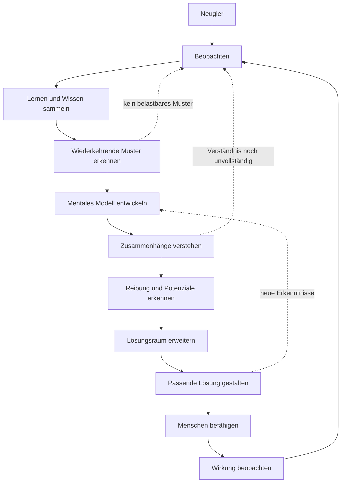

Manchmal hat man viele richtige Teile vor sich liegen und erkennt trotzdem noch kein klares Bild.

Bei mir waren diese Teile ziemlich unterschiedlich: Hochschulverwaltung, DMS-Projekte, Technische Kommunikation, BWL, Controlling, Qualitätsmanagement, Web-Projekte, Smart Home, KI-gestützte Entwicklung, Mapply, ClearControl, LIFE-EQ – und dazu die Rückmeldungen von Menschen, die mich aus sehr verschiedenen Kontexten kennen.

Alles war irgendwie verbunden. Aber es war schwer, daraus eine klare berufliche Identität zu formulieren.

Genau dafür habe ich einen mehrtägigen Workshop im Dialog mit ChatGPT gemacht. Nicht als Ersatz für eigene Reflexion, sondern als Sparringspartner: Fragen stellen, Muster spiegeln, Widersprüche sichtbar machen, Begriffe testen und die vielen Einzelteile immer wieder neu sortieren.

## Das Problem: Zu viele richtige Spuren

Mein Lebenslauf wirkt auf den ersten Blick nicht wie eine einzige gerade Linie.

Da ist Betriebswirtschaft. Da ist Technische Kommunikation. Da ist Verwaltung. Da sind Digitalisierungsprojekte. Da ist Prozessgestaltung. Da sind eigene Web-Apps. Da ist KI. Da ist Design. Da ist der starke Impuls, Dinge selbst zu bauen.

Lange war die Frage: Was davon ist der rote Faden?

Bin ich eher Projektmanager? Produktmensch? Prozessgestalter? Technischer Kommunikator? Digitalisierer? Gründer? Vibe-Coder? Generalist?

Jede dieser Antworten stimmt ein bisschen. Aber keine hat sich vollständig angefühlt.

## Der Workshop: Muster statt Jobtitel

In diesem Workshop ging es deshalb nicht zuerst um einen Jobtitel, sondern um wiederkehrende Muster.

Was tue ich immer wieder, unabhängig vom Kontext?

Welche Situationen ziehen mich an?

Wofür fragen mich andere um Hilfe?

Welche Projekte fühlen sich nach mir an?

Und wann entsteht bei mir wirklich Energie?

Die Antwort lag nicht in einer einzelnen Branche oder Rolle. Sie lag in einer wiederkehrenden Arbeitsweise: Ich versuche zuerst Menschen und Systeme zu verstehen, bevor ich gemeinsam mit anderen den nächsten sinnvollen Entwicklungsschritt gestalte.

> Ich musste meine berufliche Identität nicht über einen Titel erklären. Ich konnte sie über ein Arbeitsmuster beschreiben.

Das klingt nüchtern. Für mich war es aber ein wichtiger Perspektivwechsel.

Gerade weil ChatGPT dabei beteiligt war, war mir wichtig, nicht einfach schöne Formulierungen zu übernehmen. Entscheidend war, ob die Aussagen durch echte Erfahrungen, Projekte und Rückmeldungen belastbar sind.

## TCOM: Tristan Cognitive Operating Model

Aus dieser Arbeit entstand für mich **TCOM: Tristan Cognitive Operating Model**.

Nicht als offizieller Fachbegriff. Eher als persönliche Beschreibung meines Denk- und Arbeitsprozesses.

TCOM beschreibt einen Zyklus, der sich in vielen beruflichen und privaten Situationen wiederholt:

1. **Neugier**: Etwas irritiert mich oder zieht meine Aufmerksamkeit an.
2. **Beobachten**: Ich bewerte nicht sofort, sondern versuche zu verstehen, was wirklich passiert.
3. **Lernen und Muster erkennen**: Einzelne Beobachtungen werden zu wiederkehrenden Zusammenhängen.
4. **Mentales Modell entwickeln**: Aus vielen Einzelteilen entsteht ein inneres Bild des Systems.
5. **Reibung und Potenziale erkennen**: Ich sehe, wo Menschen unnötig Energie verlieren oder wo etwas besser funktionieren könnte.
6. **Lösungsraum erweitern**: Ich suche nicht sofort die eine richtige Lösung, sondern mehrere mögliche Wege.
7. **Gestalten**: Aus dem Verständnis entsteht ein Prozess, ein Produkt, ein Prototyp oder ein konkreter nächster Schritt.
8. **Menschen befähigen**: Das Ziel ist nicht Abhängigkeit von Expertenwissen, sondern mehr Orientierung und Selbstständigkeit.

Der eigentliche Motor dahinter ist Discovery.

Nicht im Sinne eines Methodenworts, sondern ganz praktisch: beobachten, fragen, zuhören, vergleichen, verstehen.

## Menschen vor Technologie

Eine wichtige Erkenntnis aus dem Workshop war: Im Mittelpunkt steht bei mir nicht die Technologie.

Technologie interessiert mich sehr. KI, Web-Apps, Automatisierung, Datenmodelle und digitale Werkzeuge geben mir enorme Möglichkeiten. Aber sie sind nicht der eigentliche Zweck.

Der Zweck sind Menschen.

Technologie, Prozesse und Organisation sind für mich Werkzeuge, um Orientierung zu geben, unnötige Reibung zu reduzieren und Hilfe zur Selbsthilfe zu ermöglichen.

> Technologie ist nicht der Mittelpunkt. Sie ist ein Werkzeug, um Menschen handlungsfähiger zu machen.

Das erklärt, warum mich bestimmte Probleme so stark beschäftigen.

Nicht, weil sie technisch besonders spektakulär sind. Sondern weil Menschen sich an schlechte Systeme gewöhnt haben.

> Viele Probleme bleiben bestehen, weil Menschen gelernt haben, schlechte Systeme zu kompensieren.

## Irritation als Auslöser

Viele meiner Projekte beginnen nicht mit einer fertigen Idee, sondern mit Irritation.

Etwas wirkt unnötig kompliziert. Menschen akzeptieren einen Zustand, obwohl er offensichtlich Reibung erzeugt. Fachbereich und Technik sprechen aneinander vorbei. Niemand besitzt das Gesamtbild. Wissen liegt bei einzelnen Personen. Oder ein Prozess funktioniert nur, weil alle irgendwie gelernt haben, ihn zu umgehen.

> Irritation ist oft der erste Hinweis darauf, dass unter der Oberfläche ein Muster liegt.

Diese Irritation löst bei mir Neugier aus.

Nicht mit dem Ziel, sofort eine Lösung vorzuschlagen. Sondern mit dem Wunsch zu verstehen, warum das System so funktioniert.

Erst wenn daraus ein belastbares mentales Modell entstanden ist, beginnt für mich die eigentliche Gestaltung.

## Warum meine Projekte zusammengehören

Durch TCOM wurden Projekte verbunden, die vorher eher nebeneinander standen.

ClearControl ist nicht nur ein Smart-Home-Tool. Es entsteht aus der Beobachtung, dass physische Interfaces oft unverständlich sind, obwohl sie täglich genutzt werden. Wenn niemand weiß, welcher Schalter welche Funktion auslöst, ist das kein individuelles Versagen. Es ist ein System, das zu wenig Orientierung gibt.

Mapply ist nicht nur ein Bewerbungstool. Es entsteht aus der Reibung, dass berufliche Wechselbereitschaft oft an verstreuten Dokumenten, unklarer Argumentation und fehlender Struktur scheitert. Menschen sehen passende Stellen, schaffen es aber nicht immer, daraus eine konsistente Bewerbung zu machen bzw. sich überhaupt zu bewerben.

Das Zahlenportal war nicht nur ein Dashboard. Es war der Versuch, Zahlen, Begriffe und Entscheidungsgrundlagen so aufzubereiten, dass andere damit selbstständig arbeiten können.

In allen drei Fällen geht es nicht nur um Software.

Es geht um gemeinsames Verständnis, reduzierte Komplexität und bessere Handlungsfähigkeit.

> Gute Systeme machen Menschen weniger abhängig von implizitem Wissen einzelner Personen.

## Was andere in mir gespiegelt haben

Die Rückmeldungen aus meinem Umfeld haben diesen Eindruck verstärkt.

Viele sehen mich als jemanden, der komplexe Dinge schnell erfasst, technisch tief eintaucht, kreativ denkt und gleichzeitig verständlich erklären kann. Jemand, der nicht nur Ideen hat, sondern sie auch in eine Form bringt.

Das war für mich wichtig, weil sich vieles davon für mich selbst lange selbstverständlich angefühlt hat.

Der Workshop hat daraus kein künstliches Personal Branding gemacht. Er hat eher sichtbar gemacht, was ohnehin schon da war.

## Berufliche Identität als Arbeitsversprechen

Wenn ich das heute verdichten müsste, würde ich es so formulieren:

> Ich helfe Organisationen dabei, unklare oder reibungsreiche Systeme so zu verstehen und weiterzuentwickeln, dass Menschen besser damit arbeiten können.

Oder kürzer:

> Ich übersetze unklare Prozesse, Ideen und technische Möglichkeiten in funktionierende digitale Systeme.

Diese Sätze sind für mich keine Werbesprüche. Sie sind eher Beobachtungen.

Sie passen zur Hochschule. Sie passen zu Mapply. Sie passen zu ClearControl. Sie passen zu meiner Website. Und sie passen zu dem, was ich gerade beruflich suche.

## Was TCOM für mich jetzt bedeutet

Tristans TCOM ist kein fertiges Berufsbild.

Es ist ein Kompass.

Passend sind Aufgaben, in denen ich Systeme verstehen darf, bevor Lösungen entwickelt werden. Rollen, in denen Fachbereiche, IT, Management und Nutzer zusammenkommen. Umgebungen, in denen es Gestaltungsspielraum, offene Kommunikation, Nutzerorientierung und echte Veränderungsbereitschaft gibt.

Weniger passend sind Rollen, in denen es nur um Verwaltung bestehender Lösungen, reine Projektadministration, starre Hierarchien oder dauerhafte Routine ohne Gestaltungsspielraum geht.

Auch das war eine wichtige Erkenntnis:

Ich suche nicht einfach einen Jobtitel.

Ich suche Aufgaben, in denen mein Operating Model wirksam werden kann.
