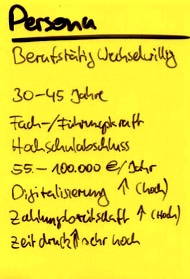

Es gibt diesen Punkt, an dem ein Projekt nicht mehr nur ein Projekt ist.

Mapply war zuerst eine Lösung für mein eigenes Problem. Ich wollte meinen Bewerbungsprozess besser organisieren, meine Unterlagen strukturierter verwalten und nicht jedes Mal wieder bei Null anfangen, wenn eine interessante Stelle auftaucht.

Das war greifbar. Das konnte ich bauen. Da wusste ich, wo die Reibung liegt.

Schwieriger wird es jetzt an einer anderen Stelle: Wie wird daraus ein Produkt?

## Bauen ist nicht das ganze Problem

Ich merke gerade sehr deutlich, dass mein natürlicher Reflex das Bauen ist. Wenn etwas unklar ist, will ich es strukturieren. Wenn ein Prozess nervt, will ich ihn in ein System übersetzen. Wenn eine Idee im Kopf hängt, will ich einen Prototyp sehen.

Bei Mapply reicht das aber nicht.

Ein SaaS-Produkt braucht nicht nur Funktionen. Es braucht eine Zielgruppe, eine klare Positionierung, ein Nutzenversprechen, einen Einstieg, Vertrauen und irgendwann auch ein Geschäftsmodell.

Das klingt selbstverständlich. Aber es fühlt sich anders an, wenn man selbst davorsteht.

## Für wen ist Mapply wirklich?

Eine der schwierigsten Fragen ist gerade: Für wen baue ich Mapply zuerst?

 Für Menschen in beruflicher Neuorientierung? Für Berufstätige, die wechselwillig sind, aber Bewerbungen immer wieder aufschieben? Für Bewerbungscoaches? Für Menschen, die mit KI arbeiten wollen, aber keinen unkontrollierten Bewerbungsgenerator suchen?

Jede Antwort verändert das Produkt.

Wenn ich für wechselwillige Berufstätige baue, geht es stark um Geschwindigkeit, Verfügbarkeit und wenig Reibung. Wenn ich für Menschen in einer Krise oder Neuorientierung baue, geht es stärker um Klarheit, Selbstsortierung und Sicherheit. Wenn ich für Coaches denke, wird Mapply vielleicht eher ein gemeinsamer Arbeitsraum.

Und genau hier merke ich den Unterschied zwischen „ich baue etwas, das mir hilft“ und „ich bringe etwas auf den Markt“.

## Founderblocks, SCE und die Realität davor

Deshalb schaue ich gerade auch bewusst nach außen. Gespräche, Programme, Sparring, Strukturen. Founderblocks ist für mich interessant, weil es genau um diese Übersetzung gehen kann: aus Idee, Prototyp und persönlichem Antrieb eine tragfähigere Produktlogik machen.

Die Gespräche mit Founderblocks waren deshalb wertvoll, auch wenn sie am Ende nicht in eine Zusammenarbeit geführt haben. Das ist nicht unbedingt ein Scheitern. Eher ein Realitätscheck: Nicht jedes gute Gespräch wird sofort zur passenden Struktur, und nicht jede externe Unterstützung passt zum aktuellen Stand eines Projekts.

Auch die Bewerbung für die **SCE Incubation 2026** ist für mich mehr als ein Formular. Sie zwingt mich, Mapply so zu erklären, dass andere den Kern verstehen. Nicht als privates Tool, nicht als technische Spielerei, sondern als mögliche Lösung für ein echtes Problem.

Gleichzeitig bewerbe ich mich dort mit einem Bewusstsein für die Lücke: Die geforderten 30 Interviews sind noch nicht abgeschlossen. Ich bin noch dran. Das ist unangenehm, weil es die Bewerbung unperfekt macht. Aber vielleicht ist genau das ehrlich: Mapply ist an einem Punkt, an dem genug Substanz da ist, um es zu zeigen – und zugleich noch genug offene Fragen da sind, um Sparring wirklich zu brauchen.

Das ist hilfreich. Und unangenehm.

Denn sobald man eine Idee öffentlich oder halböffentlich formuliert, wird sie prüfbar. Dann reicht das eigene Gefühl nicht mehr. Dann kommen Fragen:

- Wer hat dieses Problem wirklich?
- Wie akut ist es?
- Wofür würden Menschen zahlen?
- Welche Alternative nutzen sie heute?
- Ist der Schmerz groß genug?
- Ist mein Lösungsansatz einfach genug?

Das sind gute Fragen. Aber sie machen das Projekt auch ernster.

## Der eigentliche Struggle

Mein Struggle ist gerade nicht, ob ich Mapply sinnvoll finde. Das tue ich.

Der Struggle ist, ob ich den Mut und die Klarheit finde, daraus ein echtes Angebot zu machen. Mit einer ersten Zielgruppe. Mit einem ersten Versprechen. Mit einer Version, die nicht alles kann, aber genug löst, um getestet zu werden.

Ich merke auch, wie schnell ich ins Weiterbauen ausweichen kann. Noch ein Feature. Noch eine bessere Struktur. Noch ein saubererer Flow. Alles sinnvoll – aber vielleicht nicht immer der nächste wichtigste Schritt.

Manchmal wäre der wichtigere Schritt, mit Menschen zu sprechen, die genau dieses Problem haben. Zu verstehen, wann Bewerbungen liegen bleiben. Was sie wirklich blockiert. Was sie heute nutzen. Wo KI helfen darf und wo sie eher Misstrauen erzeugt.

## Was ich als Nächstes klären muss

Für mich stehen gerade ein paar Fragen im Raum:

- Ist Mapply zuerst ein Tool für berufstätige Wechselwillige?
- Oder eher ein System für Menschen in beruflicher Neuorientierung?
- Wie viel KI ist hilfreich, ohne dass es beliebig oder unpersönlich wird?
- Was ist der kleinste Produktumfang, der echten Nutzen stiftet?
- Wie erkläre ich Mapply in einem Satz, ohne dass es nach „noch ein Bewerbungstool“ klingt?

Ich habe darauf noch keine endgültigen Antworten.

Aber vielleicht ist genau das gerade die eigentliche Arbeit: nicht nur weiterzubauen, sondern den Markt, die Zielgruppe und den ersten Einstieg zu verstehen.

Mapply ist aus meiner eigenen Krise und meinem eigenen Prozess entstanden. Jetzt muss ich herausfinden, ob daraus ein Produkt werden kann, das auch anderen hilft.

Das ist ein anderer Schritt als Prototyping.

Und vermutlich genau der Schritt, den ich jetzt lernen muss.
